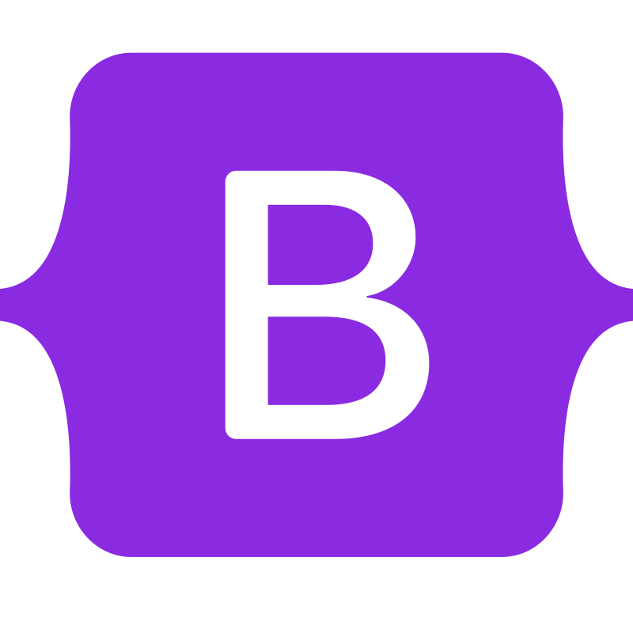

<h1 align="center">Esempi di Siti Web</h1>

      
      
      
      

  <em>
    Questa repository offre esempi pratici di siti web di base, aiutandoti a comprendere e sperimentare le tecnologie fondamentali del web attraverso progetti concreti.
     
    Ogni esempio è pensato per mostrare casi d’uso reali, rendendo i concetti più semplici da capire.
  </em>

---

## Funzionalità

- Esempi di **layout responsive**
- Effetti e animazioni con **CSS**
- Script interattivi con **JavaScript**
- Integrazione del framework front-end **Bootstrap**

## Contenuto

- `sito-bootstrap`: Sito web **stile wiki** dedicato ai **videogiochi**
- `sito-technovum`: Sito web per un’**azienda IT** che offre **servizi Web**

## Risorse Aggiuntive

Tutorial/guide **HTML**, **CSS** e **JavaScript**: [**W3Schools**](https://www.w3schools.com/) - [**GeeksforGeeks**](https://www.geeksforgeeks.org/web-tech/web-technology/)

Riferimenti per _sito-bootstrap_: **[Documentazione Bootstrap](https://getbootstrap.com/docs/5.3/getting-started/introduction/) `v5.3.8`**

---

🌍 Leggilo in:

- [English](README.md)
- [Italiano](README.it.md)
