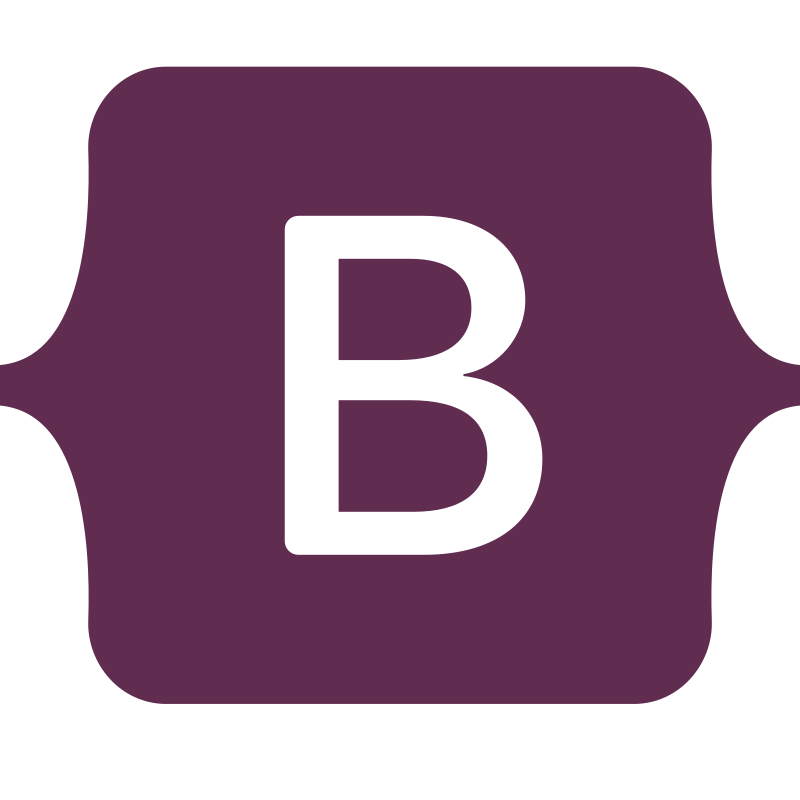

<h1 align="center">Website Examples</h1>

  <table align="center">
    <tr>
      <td></td>
      <td></td>
      <td></td>
      <td></td>
    </tr>
  </table>
  <em>This repository offers hands-on examples of basic websites, helping you understand and experiment with core web technologies through practical projects.
     Each example focuses on practical use cases to make concepts easier to understand.</em>
   

---

## Features

- `Examples of responsive layouts`
- `Effects and animations with CSS`
- `Interactive scripts with JavaScript`
- `Simple projects to practice`
- `Integration with the Bootstrap front-end framework`

## List

- `sito-bootstrap`: Video game wiki-style website.
- `sito-technovum`: Website for an IT company offering Web services.

## Additional Resources

To deepen your knowledge of **HTML**, **CSS**, and **JavaScript**, check out the tutorials on [W3Schools](https://www.w3schools.com/).

For the `sito-bootstrap` example, refer to the official [Bootstrap documentation](https://getbootstrap.com/docs/5.3/getting-started/introduction/).
